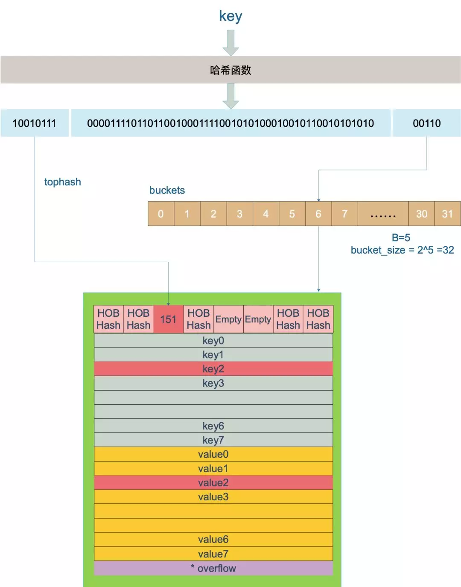

####很好的总结：https://zhuanlan.zhihu.com/p/360306642
- 值类型：基本数据类型 int 系列,float 系列,bool,string 、数组和结构体struct
- 引用类型：指针、slice切片、map、管道chan、interface 等都是引用类型
####make 和 new 的区别？
make 只适用于映射、切片和信道且不返回指针。若要获得明确的指针， 请使用 new 分配内存。
####GMP模型：https://juejin.cn/post/6886321367604527112
G-M-P分别代表：  
- G - Goroutine，Go协程，是参与调度与执行的最小单位
- M - Machine，指的是系统级线程
- P - Processor，指的是逻辑处理器，P关联了的本地可运行G的队列(也称为LRQ)，最多可存放256个G。  
GMP调度流程大致如下：
- 线程M想运行任务就需得获取 P，即与P关联。
- 然从 P 的本地队列(LRQ)获取 G
- 若LRQ中没有可运行的G，M 会尝试从全局队列(GRQ)拿一批G放到P的本地队列，
- 若全局队列也未找到可运行的G时候，M会随机从其他 P 的本地队列偷一半放到自己 P 的本地队列。
- 拿到可运行的G之后，M 运行 G，G 执行之后，M 会从 P 获取下一个 G，不断重复下去。
- go func()产生的goroutine会优先放到每个P本地队列中，放满之后才选择放到全局队列
####线程有几种模型
- 1. 内核级线程模型(1:1) 
- 2. 用户级线程模型(M:1) 
- 3. 两级线程模型(M:N)
- https://www.golangroadmap.com/class/goadvanced/3-4.html#%E4%B8%80%E3%80%81%E7%BA%BF%E7%A8%8B%E6%A8%A1%E5%9E%8B
- GMP 要是M中增加的P没有G，则顺序是 全局P队列（需加锁）、其他P队列拿一半
#### Goroutine有哪几种状态
https://studygolang.com/articles/11861
####线程(M)有几种状态 -> (自旋、非自旋。)
https://golang.design/under-the-hood/zh-cn/part2runtime/ch06sched/mpg/
####每个线程/协程占用多少内存知道吗？
- 线程是有固定的栈的，基本都是2MB，当然，不同系统可能大小不太一样，但是的确都是固定分配的。
- go采用了动态扩张收缩的策略：初始化为几KB，最大可扩张到1GB。
####Goroutines在线程上的优势。
- 与线程相比，Goroutines非常便宜。它们只是堆栈大小的几个kb，堆栈可以根据应用程序的需要增长和收缩，而在线程的情况下，堆栈大小必须指定并且是固定的
- Goroutines被多路复用到较少的OS线程。在一个程序中可能只有一个线程与数千个Goroutines。如果线程中的任何Goroutine都表示等待用户输入，则会创建另一个OS线程，剩下的Goroutines被转移到新的OS线程。所有这些都由运行时进行处理，我们作为程序员从这些复杂的细节中抽象出来，并得到了一个与并发工作相关的干净的API。
- 当使用Goroutines访问共享内存时，通过设计的通道可以防止竞态条件发生。通道可以被认为是Goroutines通信的管道。
- 如果若干个Goroutine，其中有一个panic，会发生什么
- 之前的goroutine正常运行，但是发生panic之后其他goroutine就停止了
####defer可以捕获到其Goroutine的子Goroutine的panic吗
不行
####gin如何进行参数校验
- https://juejin.cn/post/6950269300309491748 可以通过 struct tag或者在init中自定义校验函数路由
####nil != nil: 的情况是
- var a *int = nil
- var b interface{} = nil
- a != b,因为a的type是*int, 而b的type是<nil>
####为什么Go不能实现得更健壮些，多次执行Unlock()也不要panic？
- 仔细想想Unlock的逻辑就可以理解，这实际上很难做到。Unlock过程分为将Locked置为0，然后判断Waiter值，如果值>0，则释放信号量。
- 如果多次Unlock()，那么可能每次都释放一个信号量，这样会唤醒多个协程，多个协程唤醒后会继续在Lock()的逻辑里抢锁，势必会增加Lock()实现的复杂度，也会引起不必要的协程切换。

####git 使用总结：
撤销git add .操作 -> git reset HEAD .

####channel底层
总结hchan结构体的主要组成部分有四个：  
- 用来保存goroutine之间传递数据的循环双向链表。=====> buf。
- 用来记录此循环链表当前发送或接收数据的下标值。=====> sendx和recvx。
- 用于保存向该chan发送和从该chan接收数据的goroutine的队列。=====> sendq 和 recvq
- 保证channel写入和读取数据时线程安全的锁。 =====> lock
ch是长度为4的带缓冲的channel，G1是发送者，G2是接收者
- 初始hchan结构体重的buf为空，sendx和recvx均为0。
- （ch<-）当G1向ch里发送数据时，首先会对buf加锁，然后将数据copy到buf中，然后sendx++，然后释放对buf的锁。
- (<-ch)当G2消费ch的时候，会首先对buf加锁，然后将buf中的数据copy到task变量对应的内存里，然后recvx++,并释放锁。
buf满了之后,如果G1继续要写入数据,此时G1会被挂起，即goroutine进行阻塞，之后等一个G2读取数据，唤醒G1，当G2尝试往空buf里面读取数据时，同时会被挂起，等待一个G1写入（此时数据之间从G1拷贝到G2）
####内存逃逸分析
指令：go run -gcflags=-m xxx.go  

引用 (golang.org) FAQ官方说的：  
准确地说，你并不需要知道，Golang 中的变量只要被引用就一直会存活，存储在堆上还是栈上由内部实现决定而和具体的语法没有关系。
知道变量的存储位置确实和效率编程有关系。如果可能，Golang 编译器会将函数的局部变量分配到函数栈帧（stack frame）上， 然而，
如果编译器不能确保变量在函数 return之后不再被引用，编译器就会将变量分配到堆上。而且，如果一个局部变量非常大，那么它也应该被分配到堆上而不是栈上
>也就是说go编译器会自动判断变量是否有可能在后面会被使用，如果会的话就被放到堆上  

- 内存逃逸的概念：函数里面的局部变量分配到堆里面，局部变量通过堆分配和回收，就叫内存逃逸。
- 内存逃逸的危害：堆是一块没有特定结构，也没有固定大小的内存区域，可以根据需要进行调整。全局变量，内存占用较大的局部变量，
  函数调用结束后不能立刻回收的局部变量都会存在堆里面。 变量在堆上的分配和回收都比在栈上开销大的多。对于 go 这种带 GC 的语言来说，会增加 gc 压力，同时也容易造成内存碎片。
- 内存逃逸发生时机：
  + 向 channel 发送指针数据。因为在编译时，不知道channel中的数据会被哪个 goroutine 接收，因此编译器没法知道变量什么时候才会被释放，因此只能放入堆中。
  + 局部变量在函数调用结束后还被其他地方使用，比如函数返回局部变量指针或闭包中引用包外的值。因为变量的生命周期可能会超过函数周期，因此只能放入堆中。
  + 在 slice 或 map 中存储指针。比如 []*string，其后面的数组可能是在栈上分配的，但其引用的值还是在堆上。
  + 切片扩容后长度太大，导致栈空间不足，逃逸到堆上。
  + 在 interface 类型上调用方法。 在 interface 类型上调用方法时会把interface变量使用堆分配， 因为方法的真正实现只能在运行时知道。
#####避免内存逃逸的办法:
- 对于小型的数据，使用传值而不是传指针，避免内存逃逸。
- 避免使用长度不固定的slice切片，在编译期无法确定切片长度，只能将切片使用堆分配。
- interface调用方法会发生内存逃逸，在热点代码片段，谨慎使用。

#####GC
go采用三色标记清扫算法
- 白色对象（可能死亡）：未被回收器访问到的对象。在回收开始阶段，所有对象均为白色，当回收结束后，白色对象均不可达。
- 灰色对象（波面）：已被回收器访问到的对象，但回收器需要对其中的一个或多个指针进行扫描，因为他们可能还指向白色对象。
- 黑色对象（确定存活）：已被回收器访问到的对象，其中所有字段都已被扫描，黑色对象中任何一个指针都不可能直接指向白色对象。  
标记过程如下：
- 起初所有的对象都是白色的；
- 从根对象出发扫描所有可达对象，标记为灰色，放入待处理队列；
- 从待处理队列中取出灰色对象，将其引用的对象标记为灰色并放入待处理队列中，自身标记为黑色；
- 重复步骤（3），直到待处理队列为空，此时白色对象即为不可达的“垃圾”，回收白色对象；  
#####根对象：
- 全局变量：程序在编译期就能确定的那些存在于程序整个生命周期的变量。
- 执行栈：每个 goroutine 都包含自己的执行栈，这些执行栈上包含栈上的变量及指向分配的堆内存区块的指针。
- 寄存器：寄存器的值可能表示一个指针，参与计算的这些指针可能指向某些赋值器分配的堆内存区块。
#####STW
通常意义上指的是从Stop The World到Start The World这一段时间间隔  
因为存在并发性，&&降低用户的感知时间

#####两个条件会破坏回收器的正确性
1. （并发过程中）黑色对象引用白色对象
2. （并发过程中） 在回收器还没扫到的时候，灰色对象指向白色对象的链接被破坏，然后刚好黑色对象引用白色对象
#####屏障机制
[GC链接](https://liangyaopei.github.io/2021/01/02/golang-gc-intro/)
- 堆区才会触发，栈不会触发--插入屏障（Dijkstra）- 灰色赋值器，当A->B时，B就会变成灰色，无论A是黑色（只有堆区节点）还是灰色，
  当遍历完所有的节点后，需要对栈区进行STW，使得栈里面的节点都被标记，然后回收所有的白色节点
- 删除屏障 （Yuasa）- 黑色赋值器：就是说在灰色节点指向白色节点，但是这个链接被删除之后就会触发，此时白色节点会变成灰色节点
特点：标记结束不需要STW，但是回收精度低，GC 开始时STW 扫描堆栈记录初始快照，保护开始时刻的所有存活对象；且容易产生“冗余”扫描；
  
####内存管理，分配流程
- object size > 32K，则使用 mheap 直接分配。
- object size < 16 byte，使用 mcache 的小对象分配器 tiny 直接分配。 （其实 tiny 就是一个指针，暂且这么说吧。）
- object size > 16 byte && size <=32K byte 时，先使用 mcache 中对应的 size class 分配。
- 如果 mcache 对应的 size class 的 span 已经没有可用的块，则向 mcentral 请求。
- 如果 mcentral 也没有可用的块，则向 mheap 申请，并切分。
- 如果 mheap 也没有合适的 span，则想操作系统申请。
####小对象分配
当对一个小对象（<32KB）分配内存时，会将该对象所需的内存大小调整到某个能够容纳该对象的大小等级（size class）， 并查看 mcache 中对应等级的 mspan，通过扫描 mspan 的 freeindex 来确定是否能够进行分配。  
当没有可分配的 mspan 时，会从 mcentral 中获取一个所需大小空间的新的 mspan，从 mcentral 中分配会对其进行加锁， 但一次性获取整个 span 的过程均摊了对 mcentral 加锁的成本。
如果 mcentral 的 mspan 也为空时，则它也会发生增长，从而从 mheap 中获取一连串的页，作为一个新的 mspan 进行提供。 而如果 mheap 仍然为空，或者没有足够大的对象来进行分配时，
则会从操作系统中分配一组新的页（至少 1MB）， 从而均摊与操作系统沟通的成本。
####微对象分配
对于过小的微对象（<16B），它们的分配过程与小对象的分配过程基本类似，但是是直接存储在 mcache 上，并由其以 16B 的块大小直接进行管理和释放。
####大对象分配
大对象分配非常粗暴，不与 mcache 和 mcentral 沟通，直接绕过并通过 mheap 进行分配。

####概念介绍
#####mspan
mspan 是相同大小等级的 span 的双向链表的一个节点，每个节点还记录了自己的起始地址、 指向的 span 中页的数量。
然而管理 arena 如此粒度的内存并不符合实践，相反，所有的堆对象都通过 span 按照预先设定好的 大小等级分别分配，小于 32KB 的小对象则分配在固定大小等级的 span 上，
否则直接从 mheap 上进行分配。
#####mcache
是一个 per-P 的缓存，它是一个包含不同大小等级的 span 链表的数组，其中 mcache.alloc 的每一个数组元素 都是某一个特定大小的 mspan 的链表头指针。
#####mcentral
当 mcache 中 span 的数量不够使用时，会向 mcentral 的 nonempty 列表中获得新的 span。
当 mcentral 中 nonempty 列表中也没有可分配的 span 时，则会向 mheap 提出请求，从而获得 新的 span，并进而交给 mcache。

####Context
上下文 context.Context Go 语言中用来设置截止日期、同步信号，传递请求相关值的结构体。上下文与 Goroutine 有比较密切的关系，
是 Go 语言中独特的设计，在其他编程语言中我们很少见到类似的概念。
#####四个方法
- Deadline：返回的第一个值是 截止时间，到了这个时间点，Context 会自动触发 Cancel 动作。返回的第二个值是 一个布尔值，true 表示设置了截止时间，false 表示没有设置截止时间，如果没有设置截止时间，就要手动调用 cancel 函数取消 Context。
- Done：返回一个只读的通道（只有在被cancel后才会返回），类型为 struct{}。当这个通道可读时，意味着parent context已经发起了取消请求，根据这个信号，开发者就可以做一些清理动作，退出goroutine。
- Err：返回 context 被 cancel 的原因。
- Value：返回被绑定到 Context 的值，是一个键值对，所以要通过一个Key才可以获取对应的值，这个值一般是线程安全的。  
为啥需要context：因为goroutine里面可能还会产生goroutine,也就是说这样通过channel和mutex来设计的话比较麻烦，context可以关闭父节点下所有子节点goroutine的执行
  
ctx, cancel := context.WithCancel(context.Background())  调用cancel()后channel可读 case <- ctx.Done()
#####实现
- func WithCancel(parent Context) (ctx Context, cancel CancelFunc) 可无限继承
- func WithDeadline(parent Context, deadline time.Time) (Context, CancelFunc)
- func WithTimeout(parent Context, timeout time.Duration) (Context, CancelFunc)
- func WithValue(parent Context, key, val interface{}) Context
#####Context 使用注意事项
- 通常 Context 都是做为函数的第一个参数进行传递（规范性做法），并且变量名建议统一叫 ctx
- Context 是线程安全的，可以放心地在多个 goroutine 中使用。
- 当你把 Context 传递给多个 goroutine 使用时，只要执行一次 cancel 操作，所有的 goroutine 就可以收到 取消的信号
- 不要把原本可以由函数参数来传递的变量，交给 Context 的 Value 来传递。
- 当一个函数需要接收一个 Context 时，但是此时你还不知道要传递什么 Context 时，可以先用 context.TODO 来代替，而不要选择传递一个 nil。
- 当一个 Context 被 cancel 时，继承自该 Context 的所有 子 Context 都会被 cancel。
#####结构体标签（struct tag）
- xml	https://pkg.go.dev/encoding/xml
- json	https://pkg.go.dev/encoding/json
- validate	https://github.com/go-playground/validator
- parser	https://pkg.go.dev/github.com/alecthomas/participle
- protobuf	https://github.com/golang/protobuf
- db	https://github.com/jmoiron/sqlx
- url	https://github.com/google/go-querystring

####Slice底层
切片本身是一个只读对象，其工作机制类似数组指针的一种封装。
>type slice struct {  
	array unsafe.Pointer  
	len   int  
	cap   int  
}

- nil切片：nil 切片被用在很多标准库和内置函数中，描述一个不存在的切片的时候，就需要用到 nil 切片。比如函数在发生异常的时候，返回的切片就是 nil 切片。nil 切片的指针指向 nil。
- 空切片:空切片一般会用来表示一个空的集合。比如数据库查询，一条结果也没有查到，那么就可以返回一个空切片。空切片和 nil 切片的区别在于，空切片指向的地址不是nil，指向的是一个内存地址，但是它没有分配任何内存空间，即底层元素包含0个元素。

#####扩容：
- 如果期望容量大于当前容量的两倍就会使用期望容量；
- 如果当前切片的长度小于 1024 就会将容量翻倍；
- 如果当前切片的长度大于 1024 就会每次增加 25% 的容量，直到新容量大于期望容量；
- 实际情况：不是简单如上所述，而是与数据类型有关，当数据类型size为1字节，8字节，或者2的倍数时，会根据内存大小进行向上取整，之后返回新的扩容大小。

####Map
####哈希冲突
- 开放寻址法（一次函数、二次函数）
- 链地址法
- 二次哈希法
 
  
key定位过程
上图中，假定 B = 5，所以 bucket 总数就是 2^5 = 32。首先计算出待查找 key 的哈希，使用低 5 位 00110，
找到对应的 6 号 bucket，使用高 8 位 10010111，对应十进制 151，在 6 号 bucket 中寻找 tophash 值（HOB hash）为 151 的 key，找到了 2 号槽位，这样整个查找过程就结束了。
如果在 bucket 中没找到，并且 overflow 不为空，还要继续去 overflow bucket 中寻找，直到找到或是所有的 key 槽位都找遍了，包括所有的 overflow bucket。
- hmap: 里面的buckets指针指向一个[]bmap(也就是bucket数组)
#####满足扩容的条件
- 条件1：loadFactor := count / (2^B) 《《《《 count 就是 map 的元素个数，2^B 表示 bucket 数量。装载因子超过阈值，源码里定义的阈值是 6.5。
- 条件2：overflow 的 bucket 数量过多：当 B 小于 15，也就是 bucket 总数 2^B 小于 2^15 时，overflow 的 bucket 数量超过 2^B；扩容 当 B >= 15，
也就是 bucket 总数 2^B 大于等于 2^15， overflow 的 bucket 数量超过 2^15。扩容。
  

######对于命中条件 1，2 的限制，都会发生扩容。但是扩容的策略并不相同，毕竟两种条件应对的场景不同。
- 对于条件 1，元素太多，而 bucket 数量太少，很简单：将 B 加 1，bucket 最大数量（2^B）直接变成原来 bucket 数量的 2 倍。于是，
  就有新老 bucket 了。注意，这时候元素都在老 bucket 里，还没迁移到新的 bucket 来。而且，新 bucket 只是最大数量变为原来最大数量（2^B）的 2 倍（2^B * 2）。
- 对于条件 2，其实元素没那么多，但是 overflow bucket 数特别多，说明很多 bucket 都没装满。
  解决办法就是开辟一个新 bucket 空间，将老 bucket 中的元素移动到新 bucket，使得同一个 bucket 中的 key 排列地更紧密。
  这样，原来，在 overflow bucket 中的 key 可以移动到 bucket 中来。结果是节省空间，提高 bucket 利用率，map 的查找和插入效率自然就会提升。
- 对于条件 2 的解决方案，曹大的博客里还提出了一个极端的情况：如果插入 map 的 key 哈希都一样，就会落到同一个 bucket 里，
  超过 8 个就会产生 overflow bucket，结果也会造成 overflow bucket 数过多。移动元素其实解决不了问题，因为这时整个哈希表已经退化成了一个链表，操作效率变成了 O(n)。
- 再来看一下扩容具体是怎么做的。由于 map 扩容需要将原有的 key/value 重新搬迁到新的内存地址，
  如果有大量的 key/value 需要搬迁，会非常影响性能。因此 Go map 的扩容采取了一种称为“渐进式”地方式，原有的 key 并不会一次性搬迁完毕，每次最多只会搬迁 2 个 bucket。

#####sync.map与map的区别，怎么实现的
往nil（即没有make过） map里面添加键值对会panic，
map类型的值不是并发安全的，即使只是添加或删除操作，也是不安全的，根本原因在于字典值内部有时候会根据需要进行存储方面的调整  
并发安全的话使用sync.map
Go 的内建 map 是不支持并发写操作的，原因是 map 写操作不是并发安全的，当你尝试多个 Goroutine 操作同一个 map，会产生报错：fatal error: concurrent map writes。
sync.Map 的实现原理可概括为：
- 通过 read 和 dirty 两个字段将读写分离，读的数据存在只读字段 read 上，将最新写入的数据则存在 dirty 字段上
- 读取时会先查询 read，不存在再查询 dirty，写入时则只写入 dirty
- 读取 read 并不需要加锁，而读或写 dirty 都需要加锁
- 另外有 misses 字段来统计 read 被穿透的次数（被穿透指需要读 dirty 的情况），超过一定次数则将 dirty 数据同步到 read 上
- 对于删除数据则直接通过标记来延迟删除
底层数据结构
>Map 的数据结构如下：
type Map struct {
    // 加锁作用，保护 dirty 字段
    mu Mutex
    // 只读的数据，实际数据类型为 readOnly
    read atomic.Value
    // 最新写入的数据
    dirty map[interface{}]*entry
    // 计数器，每次需要读 dirty 则 +1
    misses int
}
复制代码其中 readOnly 的数据结构为：
type readOnly struct {
    // 内建 map
    m  map[interface{}]*entry
    // 表示 dirty 里存在 read 里没有的 key，通过该字段决定是否加锁读 dirty
    amended bool
}
复制代码entry 数据结构则用于存储值的指针：
type entry struct {
    p unsafe.Pointer  // 等同于 *interface{}
}
复制代码属性 p 有三种状态：
p == nil: 键值已经被删除，且 m.dirty == nil
p == expunged: 键值已经被删除，但 m.dirty!=nil 且 m.dirty 不存在该键值（expunged 实际是空接口指针）
除以上情况，则键值对存在，存在于 m.read.m 中，如果 m.dirty!=nil 则也存在于 m.dirty
Map 常用的有以下方法：
Load：读取指定 key 返回 value
Store： 存储（增或改）key-value
Delete： 删除指定 key

####golang实现线程池思路
代码可以看这个https://www.1024sou.com/article/39699.html
思路大概就是
// 定义接口 可传任意参数
type TaskFunc func(args ...interface{})
// 定义任务实体，里面有方法和参数
type Task struct {
    f    TaskFunc
    args interface{}
}
// 定义线程池对象
type WorkPool struct {
    Pool       chan *Task      //定义任务池
    WorkCount  int             //工作线程数量,决定初始化几个goroutine
    StopCtx    context.Context //上下文
    StopCancel context.CancelFunc
    WG         sync.WaitGroup //阻塞计数器
}
WorkPool有下面这些方法：
- New: 实例化一个线程池对象
- Work：使用该方法执行任务，通过select 从Pool里面拿任务执行
- Start: 主要是根据WorkCount的大小来开启go Work()
- Stop: 阻止运行
有两个细节的地方：
- main里面开启任务数的时候，要taskWg := sync.WaitGroup{}，然后要taskWg.Add(count),然后后面运行的时候，没运行一个任务
（函数）就然后要taskWg.Done()，在main函数末尾要加上然后要taskWg.Wait()
- Stop的执行是
  w.StopCancel()
  w.WG.Wait()
相应的，Work里面是
  for {
        select {
        case <-w.StopCtx.Done():
            w.WG.Done()
            fmt.Printf("线程%d 退出执行了 \n", wid)
            return
        case t := <-w.Pool:
            if t != nil {
                t.Execute()
                fmt.Printf("f被线程%d执行了，参数为%v \n", wid, t.args)
            }
        }
    }
  
####