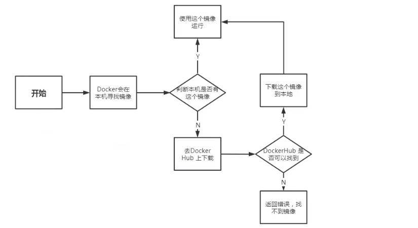
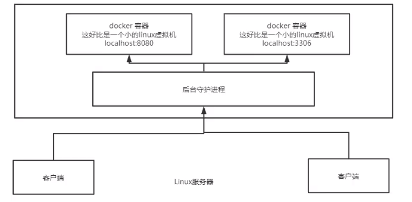

[TOC]

> author：编程界的小学生
>
> date：2021/02/11

# 一、Docker基础

## 1、什么是Docker？

是个容器化平台，他以容器的形式将应用程序和他相关的依赖都打包在一起，以确保您的应用程序在任何环境中无缝运行。

## 2、Docker能做什么？有什么鸟用？

- 他将我们开发的应用程序打成个镜像，不管是DEV还是QA还是线上，拿走镜像直接运行即可，不会再出现因为环境不一致导致程序有问题的情况，减少了扯皮的时间。

- 部署简单方便。
- 方便我们统一管理应用程序以及方便OP动态伸缩。

## 3、他与虚拟机有啥区别？

- 传统虚拟机，虚拟出一条硬件，运行一个**完整的操作系统**，然后再这个操作系统上安装软件和部署等操作。
- 容器内的应用直接运行在宿主机上，容器是没有自己内核的，也没有虚拟我们的硬件环境，多个容器之间是共享硬件资源和宿主机内核的，所以很轻便。
- 容器之间彼此隔离，每个容器内部都有一个属于自己的文件系统，互不影响。

## 4、Docker容器有哪几种状态？如何查看Docker容器的状态？

运行、已暂停、重新启动、已退出。

采取`docker ps -a`查看容器的状态。

## 5、Docker的流程是怎样的？



## 6、Docker的原理是怎样的？

Docker是一个Client-Server结构的系统，Docker的守护进程运行在主机上，通过Socket从客户端访问，DockerServer接收到Docker Client的指令就会执行对应的命令（比如`docker run`等）。

docker之间互相隔离。



## 7、什么是Docker镜像？

Docker镜像是Docker容器的源代码。用于创建容器。

使用build命令创建镜像，并且在使用run启动时它们将生成容器。镜像存储在Docker仓库中。

## 8、docker镜像和层有什么区别？

- 镜像：Docker镜像是由一些列只读层构建的；
- 层：每个层代表镜像Dockerfile中的一条指令；

重要的是，每个层只是与之前一层的一组差异层，也就是相同的层就不再重新pull了，节省了空间。

## 9、什么是Docker容器？

Docker容器包括应用程序及其所有依赖项，但与其他容器共享内核，在主机操作系统的用户空间中作为独立进程运行。Docker容器是Docker镜像的实例。

## 10、说说Docker的一些常用命令？
```shell
docker pull ：拉取或者更新指定镜像
docker push ：将镜像推送至远程仓库
docker rm ：删除容器
docker rmi ：删除镜像
docker images：列出所有镜像
docker ps：列出正在运行的所有容器
docker ps -a： 列出所有容器
docker run：启动容器
```

## 11、docker如何停止所有运行的容器？

重点考察的是$符号，相当于for循环遍历。

`docker kill $(docker ps -q)`

docker如何清理批量后台停止的容器？

` docker rm $(docker ps -a -q )`

## 12、Dockerfile中常用指令有哪些？

```shell
1）FROM:构建镜像基于哪个镜像；
2）MAINTAINER：镜像维护者姓名或邮箱地址；
3）RUN：构建镜像时运行的shell指令；
4）CMD：运行容器时执行的shell环境；
5）EXPOSE：声明容器的服务端口（仅仅是声明）；
6）ENV：设置容器环境变量；
7）ADD：拷贝文件或目录到容器中，如果是URL或压缩包便会自动下载或自动解压；
8）COPY：拷贝文件或目录到容器中，跟ADD类似，但不具备自动下载或解压的功能；
9）ENTRYPOINT：运行容器时执行的shell命令；
10）VOLUME：指定容器挂载点到宿主机自动生成的目录或其他容器；
11）USER：为RUN、CMD、和ENTRYPOINT执行命令指定运行用户；
12）WORKDIR：为RUN、CMD、ENTRYPOINT、COPY和ADD设置工作目录，意思为切换目录；
13）HEALTHCHECH：健康检查；
14）ARG：构建时指定的一些参数；
15）LABEL：我们使用LABEL按照项目，模块，许可等组织我们的镜像。我们也可以使用LABEL来帮助实现自动化。在LABEL中，我们指定一个键值对，以后可用于以编程方式处理Dockerfile；
```

## 13、Dockerfile中的COPY和ADD有啥区别？

- ADD：拷贝文件或目录到容器中，如果是URL或压缩包便会自动下载或自动解压；
- COPY：拷贝文件或目录到容器中，跟ADD类似，但不具备自动下载或解压的功能；

## 14、如何构建一个dockerfile？

- 编写一个dockerfile文件
- docker build构建成一个镜像
- docker run启动镜像为容器
- docker push发布镜像到远程仓库

## 15、dockerfile的CMD和ENTRYPOINT的区别？

两个都是运行容器时执行的shell命令的功能。

区别：

- CMD此命令会在容器启动且 docker run 没有指定其他命令时运行。

  > 比如：`CMD ["ls" "-a"]`，`docker run`的时候就会执行ls -a命令，但是docker run后面接一个其他命令参数的话就会覆盖掉CMD中的命令，比如：`docker run -l`，这时候就会报错没有-l命令，并不会拼接到`ls -a`后面变成`docker run ls -al`。

- ENTRYPOINT 的 Exec 格式用于设置容器启动时要执行的命令及其参数，同时可通过CMD命令或者命令行参数提供额外的参数。ENTRYPOINT 中的参数始终会被使用。

  > 比如：`ENTRYPOINT ["/bin/echo", "Hello"] `
  >
  > 当容器通过 `docker run -it [image] `启动时，输出为：
  >
  > ```undefined
  > Hello
  > ```
  >
  > 而如果通过 `docker run -it [image]  xxx`启动，则输出为：
  >
  > ```undefined
  > Hello xxx
  > ```
  >
  > 将Dockerfile修改为：
  >
  > ```objectivec
  > ENTRYPOINT ["/bin/echo", "Hello"]  
  > CMD ["world"]
  > ```
  >
  > 当容器通过 `docker run -it [image] `启动时，输出为：
  >
  > ```undefined
  > Hello world
  > ```
  >
  > 而如果通过 `docker run -it [image] xxx`启动，输出依旧为：
  >
  > ```shell
  > Hello xxx
  > ```
  >
  > **也就是说：ENTRYPOINT 中的参数始终会被使用，而 CMD 的额外参数可以在容器启动时动态替换掉。**

## 16、如何发布docker镜像到Dockerhub？

- 注册账号：[https://hub.docker.com/](https://hub.docker.com/)
- 登录dockerhub账号：`docker login -u username`，然后回车会让输入密码。
- 提交镜像到dockerhub，`docker push 镜像名称:TAG`

## 17、docker数据怎么持久化？

- `docker run -v 宿主机路径:容器内挂载路径 镜像名`
- Dockerfile通过`VOLUME`指定了当前容器中要备份的文件路径

>  :ro  :rw参数：
>
> :ro  只有宿主机能操作，容器内部是只读的
>
> :rw  宿主机和容器都读写权限

## 18、多个容器之间怎么实现数据共享？

让多个容器之间挂载到同一个容器的目录下。命令：

```shell
# 创建共享容器语法，只是创建不是启动。最后的/bin/true 就是一个占位符，没啥乱用。
docker create --name 共享容器名称 -v 宿主机路径:容器内挂载路径 镜像名称 /bin/true
# 启动容器的时候通过--volumes-from 共享容器名称来使用共享容器挂载点
docker run --volumes-from 共享容器名称 --name xxx -d 镜像名称
```

比如容器A挂载xxx目录到宿主机/home/work下了，然后容器B和容器C挂载到了容器A的xxx上，这时候A、B、C三个容器共享同一份挂载目录，修改其中一个，其他两个会同步修改，停掉容器且删除容器后数据也不会丢失！因为他在宿主机上有备份。

## 19、为什么需要数据共享？

如果容器太多，每一次都要写`-v xxx:xxx`，过于复杂，也容易出错，这时候可以通过`docker create`创建共享容器，然后启动的时候通过`--volumes-from`指定创建的共享容器名称即可，也就是说可以把上面`-v xxx:xxx`这一串统一放到一个地方去管理，容器启动的时候直接引用这个统一配置即可，方便统一管理。

## 20、聊聊Docker网络管理

- 单向容器间通信采取 --link，原理就是在hosts文件里添加映射。
- 双向容器间互通采取自定义网络的方式，然后将应用加入到同网络中即可双向互通。好处在于便于管理，不同集群采取不同网络。

> 主要命令：
>
> ```shell
> # 创建自定义网络叫mynet
> docker network create --driver bridge --subnet 192.168.0.0/16 --gateway 192.168.0.1 mynet
> # 将容器加入到自定义网络中。
> docker run -d -P --name tomcat-mynet-01 --net mynet tomcat
> # 不同网络之间的容器互相访问采取如下命令将其加入到同网络
> docker network connect
> ```

# 二、Docker Compose

## 1、Docker Compose是什么？有什么用?

Compose 通过一个配置文件来管理多个Docker容器，在配置文件中，所有的容器通过services来定义，然后使用docker-compose脚本来启动，停止和重启应用，和应用中的服务以及所有依赖服务的容器，非常适合组合使用多个容器进行开发的场景。

# 三、Docker Swarm

## 1、什么是Docker Swarm？

Docker Swarm是Docker的本机群集，它将Docker主机池转变为单个虚拟Docker主机。Docker Swarm提供标准的Docker API，任何已经与Docker守护进程通信的工具都可以使用Swarm透明地扩展到多个主机。

# 四、Docker的学习文档

**看下面四篇就够了，从0基础一步一截图的方式到玩转Docker！**

[一、一步一步图文结合的方式带你从零实战Docker](https://blog.csdn.net/ctwctw/article/details/106409615)

[二、Dockerfile看这一篇就够够的了](https://blog.csdn.net/ctwctw/article/details/106409809)

[三、这篇Docker的网络通信与数据共享文章看不懂你来打我吧](https://blog.csdn.net/ctwctw/article/details/106410015)

[四、DockerCompose从零基础讲解到玩转它！](https://blog.csdn.net/ctwctw/article/details/113791120)


*为什么没有Docker Swarm的学习文档？*

*哎，没那么多服务器搭建呀，我都是一步一截图的实战方式，现在条件不足，不想写一堆纯理论没实践的文章，等我资源丰富的时候别说Docker Swarm，K8S我也给它拿下！*


**Docker命令大全**

[官方网站：https://docs.docker.com/reference/](https://docs.docker.com/reference/)

[我认为最好的Docker命令整理：https://www.cnblogs.com/toutou/p/docker_command.html](https://www.cnblogs.com/toutou/p/docker_command.html)