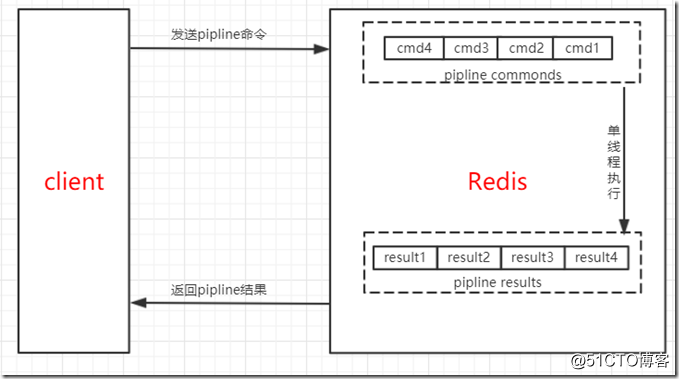
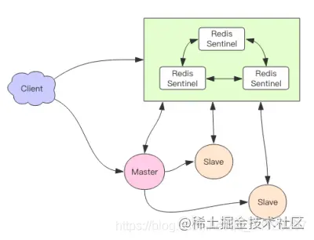
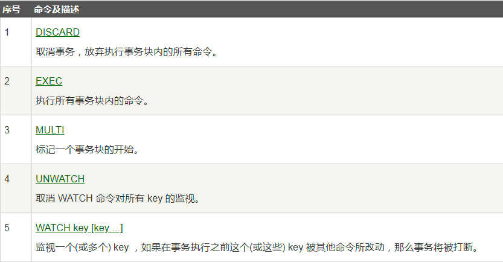

#####持久化：
如果同时使用RDB和AOF两种持久化机制，那么redis重启的时候，会使用AOF来构建数据，因为AOF的数据更加完整。
- RDB：快照形式是直接把内存中的数据保存到一个dump的文件中，定时保存，保存策略。当Redis需要做持久化时，
  Redis会fork一个子进程，子进程将数据写到磁盘上一个临时RDB文件中。当子进程完成写临时文件后，将原来的RDB替换掉。
- AOF：把所有的对Redis的服务器进行修改的命令都存到一个文件里，命令的集合。 使用AOF做持久化，
  每一个写命令都通过write函数追加到appendonly.aof中。 aof的默认策略是每秒钟fsync一次，在这种配置下，就算发生故障停机，
  也最多丢失一秒钟的数据。
#####RDB优点：
- RDB会生成多个数据文件，每个数据文件都代表了某一个时刻中redis的数据，这种多个数据文件的方式，非常适合做冷备。
- RDB对redis对外提供读写服务的时候，影像非常小，因为redis 主进程只需要fork一个子进程出来，让子进程对磁盘io来进行rdb持久化
- RDB 在恢复大数据集时的速度比 AOF 的恢复速度要快。
#####RDB缺点
- 如果redis要故障时要尽可能少的丢失数据，RDB没有AOF好，例如1:00进行的快照，在1:10又要进行快照的时候宕机了，这个时候就会丢失10分钟的数据。
- RDB每次fork出子进程来执行RDB快照生成文件时，如果文件特别大，可能会导致客户端提供服务暂停数毫秒或者几秒
#####AOF的优点：
- AOF可以更好的保护数据不丢失，一般AOF会以每隔1秒，通过后台的一个线程去执行一次fsync操作，如果redis进程挂掉，最多丢失1秒的数据。
- AOF以appen-only的模式写入，所以没有任何磁盘寻址的开销，写入性能非常高。
- AOF日志文件的命令通过非常可读的方式进行记录，这个非常适合做灾难性的误删除紧急恢复，如果某人不小心用flushall命令清空了所有数据，只要这个时候还没有执行rewrite，那么就可以将日志文件中的flushall删除，进行恢复。
#####AOF的缺点
- 对于同一份文件AOF文件比RDB数据快照要大。
- AOF开启后支持写的QPS会比RDB支持的写的QPS低，因为AOF一般会配置成每秒fsync操作，每秒的fsync操作还是很高的
- 数据恢复比较慢，不适合做冷备。
#####混合读写
混合持久化的实现原理、优缺点
描述：混合持久化并不是一种全新的持久化方式，而是对已有方式的优化。混合持久化只发生于 AOF 重写过程。使用了混合持久化，
重写后的新 AOF 文件前半段是 RDB 格式的全量数据，后半段是 AOF 格式的增量数据。
整体格式为：[RDB file][AOF tail]
开启：混合持久化的配置参数为 aof-use-rdb-preamble，配置为 yes 时开启混合持久化，在 redis 4 刚引入时，默认是关闭混合持久化的，
但是在 redis 5 中默认已经打开了。
关闭：使用 aof-use-rdb-preamble no 配置即可关闭混合持久化。
混合持久化本质是通过 AOF 后台重写（bgrewriteaof 命令）完成的，不同的是当开启混合持久化时，fork 出的子进程先将当前全量数据以 RDB 
方式写入新的 AOF 文件，然后再将 AOF 重写缓冲区（aof_rewrite_buf_blocks）的增量命令以 AOF 方式写入到文件，写入完成后通知主进程将新的含有 
RDB 格式和 AOF 格式的 AOF 文件替换旧的的 AOF 文件。

#####RDB和AOF到底如何选择
- 不要仅仅使用RDB这样会丢失很多数据。
- 也不要仅仅使用AOF，因为这一会有两个问题，第一通过AOF做冷备没有RDB做冷备恢复的速度快；第二RDB每次简单粗暴生成数据快照，更加健壮。
- 综合AOF和RDB两种持久化方式，用AOF来保证数据不丢失，作为恢复数据的第一选择；用RDB来做不同程度的冷备，在AOF文件都丢失或损坏不可用的时候，可以使用RDB进行快速的数据恢复。
- 简单来说，如果同时启用了 AOF 和 RDB，Redis 重新启动时，会使用 AOF 文件来重建数据集，因为通常来说， AOF 的数据会更完整。
- 而在引入了混合持久化之后，使用 AOF 重建数据集时，会通过文件开头是否为“REDIS”来判断是否为混合持久化。
#####缓存雪崩：
由于原有缓存失效，新缓存未到期间 例如：我们设置缓存时采用了相同的过期时间，在同一时刻出现大面积的缓存过期)，所有原本应该访问缓存的请求都去查询数据库了，而对数据库CPU和内存造成巨大压力，严重的会造成数据库宕机。从而形成一系列连锁反应，造成整个系统崩溃。
#####解决方法：
- 使用 Redis 高可用架构：使用 Redis 集群来保证 Redis 服务不会挂掉
- 缓存时间不一致，给缓存的失效时间，加上一个随机值，避免集体失效
- 限流降级策略：有一定的备案，比如个性推荐服务不可用了，换成热点数据推荐服务

#####缓存穿透：
缓存穿透是指用户查询数据，在数据库没有，自然在缓存中也不会有。这样就导致用户查询的时候，在缓存中找不到，每次都要去数据库再查询一遍，然后返回空（相当于进行了两次无用的查询）
#####解决方法：
- 存null值 -- 但是时间不超过5分钟（时间要按照实际情况来看）
  bitmaps 将key映射
- 布隆过滤器拦截：将所有可能的查询key 先映射到布隆过滤器中，查询时先判断key是否存在布隆过滤器中，存在才继续向下执行，如果不存在，则直接返回。 布隆过滤器将值进行多次哈希bit存储，布隆过滤器说某个元素在，可能会被误判。布隆过滤器说某个元素不在，那么一定不在

#####缓存击穿：
key对应的数据存在，但在redis中过期，此时若有大量并发请求过来，这些请求发现缓存过期一般都会从后端DB加载数据并回设到缓存，这个时候大并发的请求可能会瞬间把后端DB压垮。
#####缓存击穿解决方案
- 预先设置热门数据：在redis高峰访问之前，把一些热门数据提前存入到redis里面，加大这些热门数据key的时长
- 实时调整：现场监控哪些数据热门，实时调整key的过期时长
- 使用锁：就是在缓存失效的时候（判断拿出来的值为空），不是立即去load db。先使用缓存工具的某些带成功操作返回值的操作（比如Redis的SETNX）去set一个mutex key，当操作返回成功时，再进行load db的操作，并回设缓存,最后删除mutex key。当操作返回失败，证明有线程在load db，当前线程睡眠一段时间再重试整个get缓存的方法。

#####大数据去重：
- bitmap : https://www.1024sou.com/article/612080.html 类似构建[]int -- 2*8 * n -- 可以保持n * 8 个数据是否存在 0是不存在，1是存在
- 布隆过滤器： 多个hash映射到一个大的bitmap里面，

#####缓存预热：
缓存预热是指系统上线后，提前将相关的缓存数据加载到缓存系统。避免在用户请求的时候，先查询数据库，然后再将数据缓存的问题，用户直接查询事先被预热的缓存数据。
如果不进行预热，那么Redis初始状态数据为空，系统上线初期，对于高并发的流量，都会访问到数据库中， 对数据库造成流量的压力。
#####缓存预热解决方案：
- 数据量不大的时候，工程启动的时候进行加载缓存动作；
- 数据量大的时候，设置一个定时任务脚本，进行缓存的刷新；
- 数据量太大的时候，优先保证热点数据进行提前加载到缓存。

#####单线程的redis为什么这么快
1. 纯内存操作  
2. 单线程操作，避免了频繁的上下文切换
3. 采用了非阻塞I/O多路复用机制
4. 合理的数据结构，如跳表和LRU等等

######redis的数据类型，以及每种数据类型的使用场景
1. String：set key value | get key value
这个其实没啥好说的，最常规的set/get操作，value可以是String也可以是数字。一般做一些复杂的计数功能的缓存。
2. hash：hset Key field value | hget key value
这里value存放的是结构化的对象，比较方便的就是操作其中的某个字段。博主在做单点登录的时候，就是用这种数据结构存储用户信息，
   以cookieId作为key，设置30分钟为缓存过期时间，能很好的模拟出类似session的效果。
   底层数据结构：hash的底层存储有两种数据结构，一种是ziplist，另外一种是hashtable,
3. list：lpush Key value1 value2  | lrange Key start stop
使用List的数据结构，可以做简单的消息队列的功能。另外还有一个就是，可以利用lrange命令，做基于redis的分页功能，性能极佳，用户体验好。本人还用一个场景，很合适—取行情信息。就也是个生产者和消费者的场景。LIST可以很好的完成排队，先进先出的原则。
4. set：不允许有重复 | 一个集合 最大2^32 - 1 | sadd Key value1 value2 | sinter key1 key2 (取交集) sunion取并集 sdiff取差集
因为set堆放的是一堆不重复值的集合。所以可以做全局去重的功能。为什么不用JVM自带的Set进行去重？因为我们的系统一般都是集群部署，使用JVM自带的Set，比较麻烦，难道为了一个做一个全局去重，再起一个公共服务，太麻烦了。
另外，就是利用交集、并集、差集等操作，可以计算共同喜好，全部的喜好，自己独有的喜好等功能。
   底层数据结构：Set底层用两种数据结构存储，一个是hashtable，一个是inset。 其中hashtable的key为set中元素的值，而value为null
   使用inset需要满足：1. 结合对象保存的所有元素都是整数值 | 2. 集合对象保存的元素数量不超过512个
5. sorted set：zadd Key score1 member1 score2 member2 | zincrby num member | zrevrange Key start end
zset多了一个权重参数score,集合中的元素能够按score进行排列。可以做排行榜应用，取TOP N操作。

#####Redis 内部结构
1. dict 本质上是为了解决算法中的查找问题（Searching）是一个用于维护key和value映射关系的数据结构，与很多语言中的Map或dictionary类似。 本质上是为了解决算法中的查找问题（Searching）
2. sds sds就等同于char * 它可以存储任意二进制数据，不能像C语言字符串那样以字符’\0’来标识字符串的结 束，因此它必然有个长度字段。
3. skiplist （跳跃表） 跳表是一种实现起来很简单，单层多指针的链表，它查找效率很高，堪比优化过的二叉平衡树，且比平衡树的实现，
4. ziplist 压缩表 ziplist是一个编码后的列表，是由一系列特殊编码的连续内存块组成的顺序型数据结构，
zset底层：有序集合对象的编码可以是ziplist或者skiplist。同时满足以下条件时使用ziplist编码：  
- 元素数量小于128个
- 所有member的长度都小于64字节
- 以上两个条件的上限值可通过zset-max-ziplist-entries和zset-max-ziplist-value来修改。  
1. ziplist编码的有序集合使用紧挨在一起的压缩列表节点来保存，第一个节点保存member，第二个保存score。
   ziplist内的集合元素按score从小到大排序，score较小的排在表头位置。  
2. skiplist编码的有序集合底层是一个命名为zset的结构体，而一个zset结构同时包含一个字典和一个跳跃表。
   跳跃表按score从小到大保存所有集合元素。而字典则保存着从member到score的映射，
   这样就可以用O(1)的复杂度来查找member对应的score值。虽然同时使用两种结构，但它们会通过指针来共享相同元素的member和score，
   因此不会浪费额外的内存。  
3. 跳表的查询过程是怎么样的&&查询和插入的时间复杂度：
先从第一层查找，不满足就下沉到第二层找，因为每一层都是有序的，写入和插入的时间复杂度都是O(logN)
   
#####Zset为什么使用跳表，不使用红黑树，B+树这些
- 跳表实现简单，就是这么单纯的道理，
- 红黑树更改起来复杂度高，而跳表只需要更改几个指针
- 跳表返回查找简单
- 跳表无需笨重的调整，B+树有调整的代价
- 跳表占用空间比B+数要小
- B+树查找的效率高，因为是要查找存在磁盘的数据，所以要求IO次数少，但是跳表主要是用在Redis里面，操作内存，速度比较快，所以考虑节省空间  
[redis四大特性](https://blog.51cto.com/u_12874079/2147886)
1. redis的过期：
   - A.应用场景 ：cookie自动过期，限时优惠价格，限制每分钟的访问次数
   - 实现方式：setex， expire ...
   - 实现原理：定期清理+懒汉式清理 隔一段时间进行一次清理，清除掉过期的 key。比如一分钟或者是十分钟清理一次。 
     同时使用懒汉式清理，每次获取key的时候能判断一下，是否过期，是否需要清理。
2. redis的发布订阅
   - 实现方式：PUBLISH channel message #发布消息 >>> SUBSCRIBE channel [channel ...] #订阅一个或多个频道 阻塞式接收
3. redis的事务
   - 应用场景：秒杀商品的数量，抢票
   - 应用方式：watch multi exec discard
   - 实现原理：当一个key被修改后，就会对所有监控该key的客户端，设置dirty标识。  
    客户端的三种状态
    - REDIS_MULTI 客户端进入事务状态。
    - REDIS_DIRTY_EXEC 客户端事务无效状态。命令队列中有发生错误的命令。
    - REDIS_DIRTY_CAS 客户端事务处于非安全状态。watch的key已经被其他客户端抢先修改了。
4. redis的pipline
    - 应用场景：一个客户端能合并多条命令一起发送时，都推荐使用。例如，取出用户信息，并且取出该用户关注的用户列表。 
      但是，如果命令过多时（返回时间大于1秒），可以拆分到两个client分别去发送。
    - 实现方式：命令行没有，通过Java客户端Pipeline pipe = jedis.pipelined();
    - 原理：pipeline通过减少client与redis-server的连接通信的次数，来降低往返延时时间。 
      如果一次往返的时间是10ms，往返一千次，就是10秒。而通过pipline的方式，往返时间是20ms。 
      Pipeline 实现的原理是队列，即先进先出。数据的顺序性得到了保证。
      
#####redis LRU的具体实现
传统的LRU是使用栈的形式，每次都将最新使用的移入栈顶，但是用栈的形式会导致执行select *的时候大量非热点数据占领头部数据，所以需要改进。 Redis每次按key获取一个值的时候，都会更新value中的lru字段为当前秒级别的时间戳。Redis初始的实现算法很简单，随机从dict中取出五个key,淘汰一个lru字段值最小的。 在3.0的时候，又改进了一版算法，首先第一次随机选取的key都会放入一个pool中(pool的大小为16),pool中的key是按lru大小顺序排列的。 接下来每次随机选取的keylru值必须小于pool中最小的lru才会继续放入，直到将pool放满。放满之后，每次如果有新的key需要放入，需要将pool中lru最大的一个key取出。淘汰的时候，直接从pool中选取一个lru最小的值然后将其淘汰。

#####过期策略通常有以下三种：
- 定时过期：每个设置过期时间的key都需要创建一个定时器，到过期时间就会立即清除。该策略可以立即清除过期的数据，对内存很友好；但是会占用大量的CPU资源去处理过期的数据，从而影响缓存的响应时间和吞吐量。
- 惰性过期：只有当访问一个key时，才会判断该key是否已过期，过期则清除。该策略可以最大化地节省CPU资源，却对内存非常不友好。极端情况可能出现大量的过期key没有再次被访问，从而不会被清除，占用大量内存。
- 定期过期：每隔一定的时间，会扫描一定数量的数据库的expires字典中一定数量的key，并清除其中已过期的key。该策略是前两者的一个折中方案。通过调整定时扫描的时间间隔和每次扫描的限定耗时，可以在不同情况下使得CPU和内存资源达到最优的平衡效果。(expires字典会保存所有设置了过期时间的key的过期时间数据，其中，key是指向键空间中的某个键的指针，value是该键的毫秒精度的UNIX时间戳表示的过期时间。键空间是指该Redis集群中保存的所有键。)
Redis中同时使用了惰性过期和定期过期两种过期策略。

#####Redis的内存淘汰策略
默认使用noeviction
Redis的内存淘汰策略是指在Redis的用于缓存的内存不足时，怎么处理需要新写入且需要申请额外空间的数据。
- noeviction：当内存不足以容纳新写入数据时，新写入操作会报错。
- allkeys-lru：当内存不足以容纳新写入数据时，在键空间中，移除最近最少使用的key。
- allkeys-random：当内存不足以容纳新写入数据时，在键空间中，随机移除某个key。
- volatile-lru：当内存不足以容纳新写入数据时，在设置了过期时间的键空间中，移除最近最少使用的key。
- volatile-random：当内存不足以容纳新写入数据时，在设置了过期时间的键空间中，随机移除某个key。
- volatile-ttl：当内存不足以容纳新写入数据时，在设置了过期时间的键空间中，有更早过期时间的key优先移除。
#####总结
Redis的内存淘汰策略的选取并不会影响过期的key的处理。内存淘汰策略用于处理内存不足时的需要申请额外空间的数据；过期策略用于处理过期的缓存数据。

#####Redis并发竞争key如何解决？
- 乐观锁，注意不要在分片集群中使用
- 分布式锁，适合分布式系统环境
- 时间戳，适合有序场景
- 消息队列，串行化处理

#####Redis的主从模式和哨兵模式和集群模式区别？
Redis集群方式共有三种：主从模式，哨兵模式，集群(cluster)模式
#####主从模式
主从模式是三种集群方式里最简单的。它主要是基于Redis的主从复制特性架构的。通常我们会设置一个主节点，N个从节点;
默认情况下，主节点负责处理使用者的IO操作，而从节点则会对主节点的数据进行备份，并且也会对外提供读操作的处理。
#####主要的特点如下：
1. 主从模式下，当某一节点损坏时，因为其会将数据备份到其它Redis实例上，这样做在很大程度上可以恢复丢失的数据。
2. 主从模式下，可以保证负载均衡.
3. 主从模式下，主节点和从节点是读写分离的。使用者不仅可以从主节点上读取数据，还可以很方便的从从节点上读取到数据，
   这在一定程度上缓解了主机的压力。
4. 从节点也是能够支持写入数据的，只不过从从节点写入的数据不会同步到主节点以及其它的从节点下。
从以上，我们不难看出Redis在主从模式下，必须保证主节点不会宕机——一旦主节点宕机，其它节点不会竞争称为主节点，
   此时，Redis将丧失写的能力。这点在生产环境中，是致命的。
   主从复制同步机制：存在一个增量同步和快照同步，增量同步有一个buffer，增量同步同步的是指令流，
   主节点会将那些对自己数据状态产生修改性影响的指令（比如增删改）记录在本地的内存buffer中，
   然后将buffer中的指令同步到从节点中。从节点一边执行同步以达到和主节点一样的状态，一边像主节点报告自己同步到哪里了（偏移量）。
   指令流在内存中，读写速率非常快。 内存buffer是有限的，它是一个环形数组，当数组内容满了会从头开始覆盖前面的内容。这个时候就会触发
   快照同步。进行快照同步时，需要将主节点内存中的数据全部刷入磁盘文件中，然后将快照文件的内容全部传到从节点。
   从节点接收文件完毕后，会将其内存中的数据清空，然后进行一次全量加载。加载完毕后再通知主节点进行增量同步。
   当buffer设置过小时，会陷入增量同步和快照同步的死循环状态，所以要合理规划buffer大小
   - 当有新的节点加入集群时，会进行一次快照同步，同步完成后再进行增变量同步。
   - 必须配置合理的buffer大小避免出现这种复制循环的现象。
5. redis-2.8.18版本开始支持无盘复制功能：主节点通过套接字将快照内容发送到从节点，
  生成快照是一个遍历的过程：一边遍历内存一边将序列化的内容发送到从节点。从节点则还是和以前一样，先将内容存到磁盘再一次性进行加载。
#####哨兵模式
redis sentinel 是一套独立的集群，可以同时监控多个redis的 master-slave集群，可以将它看成是一套zookeeper集群。
它是集群高可用的核心，一般由3~5个节点组成，即使某个节点宕机了系统还能高效运行。
客户端连接到集群时会先连接到sentinel，通过sentinel拿到master节点的地址，然后再和主节点进行数据交互。
当主节点发生故障、宕机时，客户端会重新向sentinel发起一个请求以来获取新的master节点地址。
sentinel随后将新选举出来的master节点地址发给客户端，客户端通过新的地址继续和redis进行数据交互。

哨兵模式是基于主从模式做的一定变化，它能够为Redis提供了高可用性。  
在实际生产中，服务器难免不会遇到一些突发状况：服务器宕机，停电，硬件损坏等。这些情况一旦发生，其后果往往是不可估量的。 
而哨兵模式在一定程度上能够帮我们规避掉这些意外导致的灾难性后果。其实，哨兵模式的核心还是主从复制。 
只不过相对于主从模式在主节点宕机导致不可写的情况下，多了一个竞选机制——从所有的从节点竞选出新的主节点。竞选机制的实现，
是依赖于在系统中启动一个sentinel进程。

#####sentinel特点：
1. 监控：它会监听主服务器和从服务器之间是否在正常工作。
2. 通知：它能够通过API告诉系统管理员或者程序，集群中某个实例出了问题。
3. 故障转移：它在主节点出了问题的情况下，会在所有的从节点中竞选出一个节点，并将其作为新的主节点。
4. 提供主服务器地址：它还能够向使用者提供当前主节点的地址。这在故障转移后，使用者不用做任何修改就可以知道当前主节点地址。

sentinel，也可以集群，部署多个哨兵，sentinel可以通过发布与订阅来自动发现Redis集群上的其它sentinel。sentinel在发现其它sentinel进程后，会将其放入一个列表中，这个列表存储了所有已被发现的sentinel。 
集群中的所有sentinel不会并发着去对同一个主节点进行故障转移。故障转移只会从第一个sentinel开始，当第一个故障转移失败后，才会尝试下一个。 
当选择一个从节点作为新的主节点后，故障转移即成功了(而不会等到所有的从节点配置了新的主节点后)。这过程中，如果重启了旧的主节点，那么就会出现无主节点的情况，这种情况下，只能重启集群。 
当竞选出新的主节点后，被选为新的主节点的从节点的配置信息会被sentinel改写为旧的主节点的配置信息。完成改写后，再将新主节点的配置广播给所有的从节点。 

#####集群模式
- Redis 集群是一个提供在多个Redis间节点间共享数据的程序集, 其中Redis集群分为主节点和从节点。主节点用于处理槽,而从节点用于复制某个主节点，并在被复制的主节点下线时，代替下线的主节点继续处理命令请求。
- Redis集群并不支持处理多个keys的命令,因为这需要在不同的节点间移动数据,从而达不到像Redis那样的性能,在高负载的情况下可能会导致不可预料的错误.
- Redis 集群通过分区来提供一定程度的可用性,在实际环境中当某个节点宕机或者不可达的情况下继续处理命令. 

#####Redis 集群的优势:
- 自动分割数据到不同的节点上。
- 整个集群的部分节点失败或者不可达的情况下能够继续处理命令。
- Redis集群的数据分片 Redis 集群没有使用一致性hash, 而是引入了哈希槽的概念.  
- Redis 集群有16384个哈希槽,每个key通过CRC16校验后对16384取模来决定放置哪个槽.集群的每个节点负责一部分hash槽.  
例如,当前集群有3个节点,那么:
节点 A 包含 0 到 5500号哈希槽.  
节点 B 包含5501 到 11000 号哈希槽.  
节点 C 包含11001 到 16384号哈希槽.  
这种结构很容易添加或者删除节点. 比如如果我想新添加个节点D, 我需要从节点 A, B, C中得部分槽到D上.  
如果我想移除节点A,需要将A中的槽移到B和C节点上,然后将没有任何槽的A节点从集群中移除即可  
由于从一个节点将哈希槽移动到另一个节点并不会停止服务,所以无论添加删除或者改变某个节点的哈希槽的数量都不会造成集群不可用的状态.  
Redis 集群的主从复制模型 为了使在部分节点失败或者大部分节点无法通信的情况下集群仍然可用，所以集群使用了主从复制模型,每个节点都会有N-1个复制品.  

####redis的IO模型
一篇很好的总结：http://chenliy.com/articles/2022/03/16/1647440809412.html  
底层就是使用操作系统内核的epoll来监听吧，哪个文件描述符有数据的话就回回调通知，放入事件处理队列中，然后Redis调用相应的事件
- 要和你厘清一个事实，我们通常说，Redis 是单线程，主要是指 Redis 的网络 IO 和键值对读写是由一个线程来完成的，这也是 Redis 对外提供键值存储服务的主要流程。但 Redis 的其他功能，比如持久化、异步删除、集群数据同步等，其实是由额外的线程执行的。
- 服务端 ：redis server就是通过blocking_keys（指令队列）和ready_keys（响应队列）两个数据结构来实现的阻塞操作。但整个阻塞并没有阻塞EventLoop本身，从而实现命令的快速响应。算是一个典型的空间换时间的设计思路。
- 指令队列 ：Redis 会将每个客户端套接字都关联一个指令队列。客户端的指令通过队列来排队进行顺序处理，先到先服务。
- 响应队列 ：Redis 同样也会为每个客户端套接字关联一个响应队列。Redis 服务器通过响应队列来将指令的返回结果回复给客户端。 如果队列为空，那么意味着连接暂时处于空闲状态，不需要去获取写事件，也就是可以将当前的客户端描述符从write_fds里面移出来。等到队列有数据了，再将描述符放进去。避免select系统调用立即返回写事件，结果发现没什么数据可以写。出这种情况的线程会飙高 CPU。
- 定时任务 ：服务器处理要响应 IO 事件外，还要处理其它事情。比如定时任务就是非常重要的一件事。如果线程阻塞在 select 系统调用上，定时任务将无法得到准时调度。那 Redis 是如何解决这个问题的呢？Redis 的定时任务会记录在一个称为最小堆的数据结构中。这个堆中，最快要执行的任务排在堆的最上方。在每个循环周期，Redis 都会将最小堆里面已经到点的任务立即进行处理。处理完毕后，将最快要执行的任务还需要的时间记录下来，这个时间就是select系统调用的timeout参数。因为 Redis 知道未来timeout时间内，没有其它定时任务需要处理，所以可以安心睡眠timeout的时间。

#####redis实现事务

1. Redis服务端是个单线程的架构，不同的Client虽然看似可以同时保持连接，但发出去的命令是序列化执行的，这在通常的数据库理论下是最高级别的隔离
2. 用MULTI/EXEC 来把多个命令组装成一次发送，达到原子性（有点像命令具有打包功能）
3. 用WATCH提供的乐观锁功能，在你EXEC的那一刻，如果被WATCH的键发生过改动，则MULTI到EXEC之间的指令全部不执行，不需要rollback 
4. Discard 命令用于取消事务，放弃执行事务块内的所有命令。  
[reids事务-具体链接](https://www.cnblogs.com/myseries/p/11924733.html)


```shell
if redis is hard:
  learn it
```


------
### 待完成
- [ ] E-R 模型
- [ ] 数据库的三级模式和二级映像
- [ ] [数据类型](https://github.com/CyC2018/CS-Notes/blob/master/notes/MySQL.md#%E5%9B%9B%E6%95%B0%E6%8D%AE%E7%B1%BB%E5%9E%8B)：VARCHAR和CHAR的区别，DATETIME和TIMESATMP的区别
- [ ] Redis 面试
    - [golangroadmap-redis](https://www.golangroadmap.com/interview/books/questions/redis/)
    - [CyC2018](https://github.com/CyC2018/CS-Notes/blob/master/notes/Redis.md)
    - [几率大的Redis面试题（含答案） - CSDN](https://blog.csdn.net/Butterfly_resting/article/details/89668661)
    - [Redis面试题总结 - 简书](https://www.jianshu.com/p/65765dd10671)
    - [Redis常见面试题 - 博客园](https://www.cnblogs.com/jasontec/p/9699242.html)
    - [0voice/interview_internal_reference](https://github.com/0voice/interview_internal_reference#10)
- [ ] [史上最全的数据库面试题，不看绝对后悔 -- 博客园](https://www.cnblogs.com/wenxiaofei/p/9853682.html)